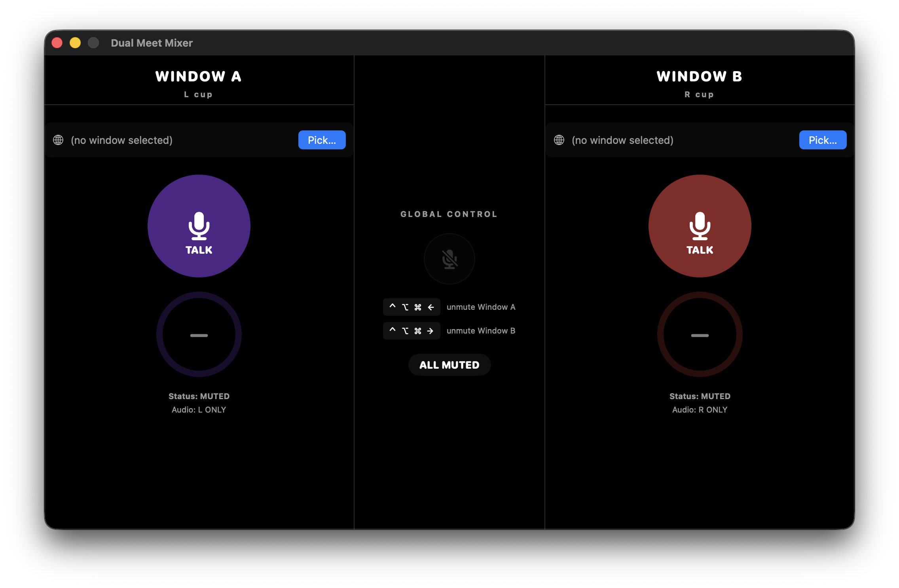

# Dual Meet Mixer

**Attend two video meetings at once on a single headset — no hardware mixer required.**



Dual Meet Mixer is a macOS menu-bar utility that lets you sit in two Google Meet calls simultaneously and stay coherent in both:

- **Spatial separation** — one meeting plays only in your **left ear**, the other only in your **right ear**, so you can follow both conversations at once.
- **Dead-man's switch mic** — your mic is muted everywhere by default. Press a global hotkey to talk to one meeting; if you don't re-confirm within a configurable window (10–60 s), you're automatically muted again. You can never be hot-mic'd in the wrong call.
- **At most one meeting hears you** — unmuting into meeting B force-mutes you in meeting A. This is enforced as an invariant, not a convention.
- **Global hotkeys** — `⌃⌥⌘←` talk to the left meeting, `⌃⌥⌘→` talk to the right meeting, `⌃⌥⌘↓` mute everywhere. They work from any app, no window focus needed.
- **Camera follows the talker (optional)** — toggles each Meet window's camera (`⌘E`) so your video is on only in the meeting you're speaking to.

No DOM injection, no UI scraping, no browser extensions. Everything happens at the system-audio level (CoreAudio process taps), so it keeps working when Meet redesigns its UI.

## How it works

```
Meeting A (browser window) ──► process tap ──► pan hard LEFT  ──┐
                                                                ├──► your headset
Meeting B (browser window) ──► process tap ──► pan hard RIGHT ──┘

your mic ──► MicMixer ──► BlackHole-A (virtual mic for Meeting A, gain 0 or 1)
                     └──► BlackHole-B (virtual mic for Meeting B, gain 0 or 1)
```

- **Output routing:** CoreAudio *process taps* (macOS 14.4+) capture each browser window's audio and re-render it panned hard left or hard right into your physical output device.
- **Mic routing:** your physical mic is mirrored into two virtual audio devices ([BlackHole](https://github.com/ExistentialAudio/BlackHole)). Each Meet call uses one of them as its microphone. "Muting" a side means writing silence to that virtual device — the meeting sees a live mic that happens to be silent, so Meet never shows you as muted/absent.
- **Cmd+D mode (optional):** instead of gating audio through BlackHole, Dual Meet Mixer can drive Meet's own mute by sending `⌘D` keystrokes to the right browser window, with state tracking to avoid toggle drift.

## Requirements

- macOS 14.4 or later (CoreAudio process-tap API)
- Two [BlackHole](https://github.com/ExistentialAudio/BlackHole) 2ch virtual devices:
  - **BlackHole 2ch** (stock install) — used as the mic for meeting A
  - **BlackHole-B** — a renamed second instance, installed by `Scripts/install-blackhole-b.sh`
- Permissions on first launch:
  - **Microphone** — to read your mic and feed the virtual devices
  - **Screen & System Audio Recording** — required by macOS for process taps to capture other apps' audio
  - **Accessibility** (only if you enable Cmd+D/Cmd+E features) — to send keystrokes to the browser

## Install

### Option 1: prebuilt binary

Grab `DualMeetMixer.app.zip` from [Releases](../../releases), unzip, and move it to `~/Applications`.

The app is ad-hoc signed (no Apple Developer ID), so Gatekeeper will complain on first launch. Either right-click → **Open** → **Open**, or:

```sh
xattr -dr com.apple.quarantine ~/Applications/DualMeetMixer.app
```

### Option 2: build from source

Requires Xcode and [XcodeGen](https://github.com/yonaskolb/XcodeGen) (`brew install xcodegen`):

```sh
git clone https://github.com/adamlahbib/DualMeetMixer.git
cd DualMeetMixer
Scripts/install-blackhole-b.sh   # once: builds + installs the BlackHole-B virtual device
Scripts/build-and-install.sh     # builds Release and installs to ~/Applications
```

## Usage

1. Open your two meetings in **separate browser windows** (not tabs of the same window).
2. Launch Dual Meet Mixer (menu-bar mic icon; the main window opens on launch).
3. Assign each pane to one of the browser windows.
4. In each Meet call, set the **microphone** to `BlackHole 2ch` (left meeting) / `BlackHole-B` (right meeting). Leave the speaker as your headset.
5. Talk with the hotkeys:
   - `⌃⌥⌘←` — talk to the left-ear meeting
   - `⌃⌥⌘→` — talk to the right-ear meeting (auto-mutes the left)
   - `⌃⌥⌘↓` — mute everywhere
6. Keep pressing your talk hotkey to stay unmuted; the countdown ring shows the time left before the dead-man's switch mutes you.

Labels, hotkeys, keep-alive timeout, input device, and the Cmd+D/camera behaviors are configurable in **Settings**.

## Limitations

- Google Meet in a Chromium-based browser is the tested target. Anything that runs in a browser window and accepts a selectable mic should work for audio routing; the `⌘D`/`⌘E` conveniences are Meet-specific shortcuts.
- One machine, one headset, exactly two meetings.
- Ad-hoc signed; not sandboxed; not on the App Store.

## Development

```sh
xcodegen generate
xcodebuild -project DualMeetMixer.xcodeproj -scheme DualMeetMixer -destination 'platform=macOS' test
```

The audio pipeline (`AudioRouter`, `MicMixer`, `ProcessTap`) is plain CoreAudio; the state machine (`MeetingController`, `MixerViewModel`) is pure Swift with injected clocks and is fully unit-tested.

## License

[PolyForm Noncommercial 1.0.0](LICENSE.md) — use, modify, and share it freely for any noncommercial purpose. Commercial use requires the author's permission.

Required Notice: Copyright (c) 2026 Adam Lahbib (https://github.com/adamlahbib/DualMeetMixer)
